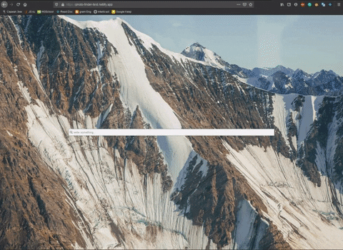
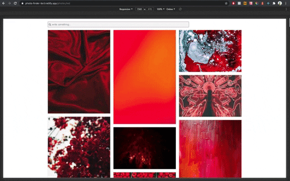
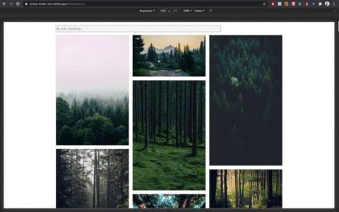
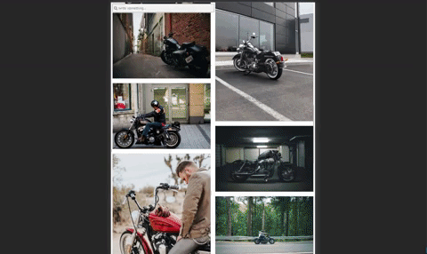

<h1 align='center'> PHOTO FINDER (TEST)</h1>

<h2 align='center'> <a href='https://photo-finder-test.netlify.app/'>View a Demo</h2>

I used free API <b> UNSPLASH <a href='https://github.com/unsplash/unsplash-js'>https://github.com/unsplash/unsplash-js</a></b> 

 

____________________________________________________________________
## What stack?
**- JAVASCRIPT**  
**- React**  
**- React-hooks**  
**- React-Context**  
**- RestAPI**  
**- STYLED-COMPONENTS**  
____________________________________________________________________

## Description

It is a simple photo finder based on the Unsplash API. You need to enter a keyword and the finder will find your images based on your keyword search. For each request, there 10 photos in response, and when you scroll to the end will start a new request for new photos.
You can share the link with others, request will work.

Photos are clickable.

The finder is built based on the screen size. I know the size of images and screens and I can display smaller images, when this is no need to display larger images.

____________________________________________________________________

**ADAPTIVE**
  
  

 

**How to share link**
  
  

 

**Clickable photo**
  
  

 

## About the project

*It is a trial work. I would say that this work was hard for me. Because not everything was clear in the task. I was trying to find the autocomplete search which was in the task and couldn't find it, because it isn't there. I have been trying for a long time to find an answer to this question on the internet and tried to get it from the Unsplash page, but Unsplash doesn't support this features.*
 

*Next level was when I was writing a custom hook and found that the hook was unmounted when the component was unmounted. It was incomprehensible to me, and I spent a lot of time trying to figure out why this is so. When I realized that these are properties of hooks, I decided to use Redux. It was evening, but in the morning I decided it would be more clear to write using React.context. I thought to write using local storage, but using it was not so easy. After all I used context. This is not the best way, it seems reasonable at that moment. Now I know, that I should have written the hook differently, or I should have used the session storage.*

*It was a good opportunity to understand how to use hooks, custom hooks, context. Find out what difference is between local storage and session storage. When I was creating indefinite scrolling, I found a solution how to build component that needs to have a height, before the image is loaded. This solution is a padding-bottom trick. If I know the size of the image, I can build the component to the height I need.*
